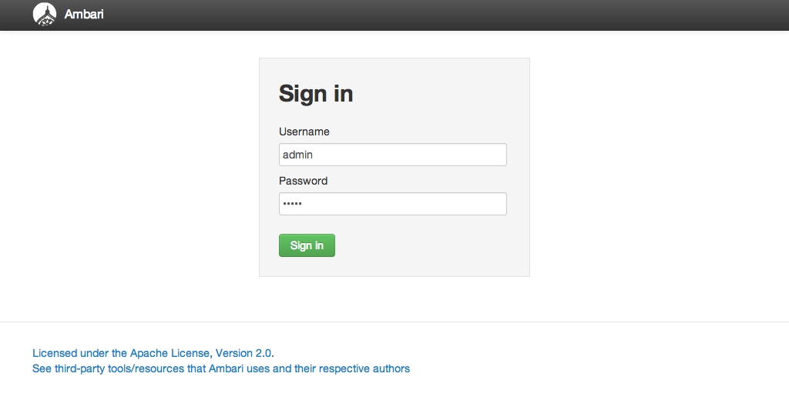

Introduction
============

***This pallet is for Stacki 4.0. If you want this pallet for Stacki 3.2, go to the release_3.2 for proper
instructions and download links.***

The Hortonworks Data Platform (HDP) is an enterprise-grade Hadoop distribution from Hortonworks. Architected, developed, and built completely in the open, HDP provides Hadoop designed to meet the needs of enterprise data processing.

The deployment of HDP on a cluster is a non-trivial task. The Ambari service, developed by Hortonworks, aids in the 
installation of HDP. Ambari provides a web interface that enables the deployment of Hadoop services across a cluster. 
However, this requires an additional deployment step. While Ambari is used to deploy HDP on a cluster, 
Ambari itself needs to be setup on a cluster too. Stacki automates the deployment of Ambari in a few simple steps.

The Stacki bridge Roll for HDP provides the software necessary to easily deploy Ambari and then HDP on a cluster.

## Installing Ambari/HDP with Stacki

### Prepare the stacki frontend

The installation of Ambari and subsequent deployment of HDP on your cluster requires:

* A working stacki frontend with an internet connection.
* The stacki-hdp-bridge pallet.
* The HDP repositories pulled from the Hortonworks site. 

Luckily, we have made this easy for you.

1. First install a stacki frontend.
This has been documented [before](https://github.com/StackIQ/stacki/wiki/Frontend-Installation). If you're on this documentation, 
you have already installed a frontend. If you are here without a stacki frontend. Go install one. Then come back. 
I can wait...(Are we there yet?)

2. Install the stacki-hdp-bridge pallet.
On your frontend, either download, add enable:

This is currently in S3 so download it:
```
# wget https://s3.amazonaws.com/stacki/public/pallets/4.0/open-source/stacki-hdp-bridge-2.6-7.x.x86_64.disk1.iso
Add and then add and enable the pallet:

# stack add pallet stacki-hdp-bridge*.iso
# stack list pallet 

to make sure it's present

Then enable it:

# stack enable pallet stacki-hdp-bridge
```

or clone, build, add, and enable
```
# git clone this https://github.com/StackIQ/stacki-hdp-bridge.git
# cd stacki-hdp-bridge
# make

Add and enable:
# stack add pallet build-stacki-hdp-bridge-master/stacki-hdp-bridge*.iso
# stack enable pallet stacki-hdp-bridge
```

Now run it. A pallet generally has both frontend and backend configuration. To get the frontend configuration to happen for a pallet that contains it, run the pallet
```
# stack run pallet stacki-hdp-bridge
```
To see what scripts are going to run. 

Then run it for real:
```
# stack run pallet stacki-hdp-bridge | bash
```
The hdp-bridge pallet creates an ambari appliance, some key/value pairs (attributes), and sets-up a directory for getting the HDP repository you want. 


### Setup Ambari and HDP repositories.

Let's get the HDP and HDP-UTILS and Ambari repositories.

#### Change configuration?

```
# cd /export/HDP

# cat hdp.cfg

[default]
distribution = 2.x
os = centos7
ambari = 2.5.0.3
hdp = 2.6.0.3
```


The hdp.cfg is an ini-style file that tells the "gethdp" program which versions of the Ambari and HDP to download. You'll note that this is latest and greatest. To get something different, change the appropriate entries and run the "gethdp" script in that directory. I don't know what to tell you if you want this on Ubuntu. Ask the question on either googlegroups or Slack. I might have an answer by then.

#### Get the distribution:

If you do:
```
# stack list pallet
```
You won't have any HDP or Ambari pallets yet. We are going to get them now.

```
# cd /export/HDP

# ./gethdp
```

This generates the ambari.repo and hdp.repo files in the /export/HDP directory. Then it uses those repo files to download the 
Updates-ambari, HDP, and HDP-Utils repositories and turns them into pallets. (Combines them into an iso file which is 
what a pallet is.) 

Now wait. Depending on your connection to the outside world, this can take minutes to hours. Go to lunch. Do yoga and then take a nap.
Go to the dentist for the three root canals you've been putting off. (I recommend the nitrous.) Or drink more coffee than you 
ever have in your life and go home a quivering mass of stressed-out flesh. In the morning, these will be done. Hopefully you'll 
have slept.

Once they're downloaded, this script will add the HDP, HDP-Utils and Ambari pallets and it will enable them too. Maybe 
that's presumptuous of me to decide that for you, but why did you download this if you weren't going to do that? (Okay, you 
can always reassign them to a different box. If you find this decision I made on your behalf to be too much like the the worst 
parts of your dysfunctional family, let us know, and I'll remove the code and happily let you add and enable your own damn pallets.)

It should look like this:
```
# stack list pallet

NAME              VERSION              RELEASE ARCH   OS     BOXES
CentOS            7                    7.x     x86_64 redhat default
stacki            4.0_20170414_c4aff2a 7.x     x86_64 redhat default
CentOS-Updates    4.0_20170414_c4aff2a 7.x     x86_64 redhat default
stacki-hdp-bridge 2.6                  7.x     x86_64 redhat default
HDP               2.6.0.3              7.x     x86_64 redhat default
HDP-UTILS         1.1.0.21             7.x     x86_64 redhat default
ambari            2.5.0.3              7.x     x86_64 redhat default
```

If your frontend does NOT have access to the internet, then running ./gethdp is, technically, fruitless. So if you don't have access, download the following on some machine that does have internet access. (If you don't have internet access anywhere within your organization, then you are not reading this and it doesn't matter then does it?)

Go get these and make sure they get on the Stacki frontend. Copying them to /export is ususally a good idea because it's usually the largest partition.

```
wget http://stacki.s3.amazonaws.com/public/pallets/3.2/open-source/HDP-2.5.3.0-7.x.x86_64.disk1.iso
wget http://stacki.s3.amazonaws.com/public/pallets/3.2/open-source/HDP-UTILS-1.1.0.21-7.x.x86_64.disk1.iso
wget http://stacki.s3.amazonaws.com/public/pallets/3.2/open-source/Updates-ambari-2.4.2.0-7.x.x86_64.disk1.iso

Check the md5sums. No really. We'll both be happy.

wget https://s3.amazonaws.com/stacki/public/pallets/3.2/open-source/md5sum.txt
```

You might also want the full CentOS distribution if you haven't done that as part of the Stacki frontend install.

```
wget https://s3.amazonaws.com/stacki/public/os/centos/7/CentOS-7-x86_64-Everything-1611.iso
wget https://s3.amazonaws.com/stacki/public/os/centos/7/CentOS-Updates-7.3-7.x.x86_64.disk1.iso

wget https://s3.amazonaws.com/stacki/public/os/centos/7/md5sum.txt
```
But this time you have to add all the pallets yourself. Like this:

```
# stack add pallet HDP-2.5.3.0-7.x.x86_64.disk1.iso HDP-UTILS-1.1.0.21-7.x.x86_64.disk1.iso Updates-ambari-2.4.2.0-7.x.x86_64.disk1.iso

Then enable:

# stack enable pallet HDP HDP-UTILS Updates-ambari
```


##### Installing an Ambari Server on a backend node

With all the right pallets added and enabled. We can go about installing an Ambari server. This goes on a "backend" node and 
not on the frontend.

The bridge pallet creates an ambari appliance when you do the "stack run pallet stacki-hdp-bridge | bash" command.

```
# stack list appliance
APPLIANCE LONG NAME PUBLIC
frontend: Frontend  no
backend:  Backend   yes
ambari:   Ambari    yes
```

This allows us to set-up the configuration on initial installation so you have a fully functioning Ambari instance. From this 
Ambari machine, you can deploy HDP on the rest of the machines. 

Separating the Ambari server from the frontend (many of our application pallets do this) separates the roles of the machines 
in the cluster. If you lose the frontend (rare), you still have a fully functioning Ambari/HDP cluster. 

Right now, they're all "backend" appliances:
```
# stack list host
HOST         RACK RANK CPUS APPLIANCE BOX     ENVIRONMENT RUNACTION INSTALLACTION
stacki34:    0    0    2    frontend  default ----------- os        install
backend-0-0: 0    0    2    backend   default ----------- os        install
backend-0-1: 0    1    2    backend   default ----------- os        install
backend-0-2: 0    2    2    backend   default ----------- os        install
backend-0-3: 0    3    2    backend   default ----------- os        install
backend-0-4: 0    4    2    backend   default ----------- os        install
```
We will designate backend-0-0 as the Ambari server by setting its appliance type to "ambari".

```
# stack set host appliance backend-0-0 appliance=ambari

# stack list host
HOST         RACK RANK CPUS APPLIANCE BOX     ENVIRONMENT RUNACTION INSTALLACTION
stacki34:    0    0    2    frontend  default ----------- os        install
backend-0-0: 0    0    2    ambari    default ----------- os        install
backend-0-1: 0    1    2    backend   default ----------- os        install
backend-0-2: 0    2    2    backend   default ----------- os        install
backend-0-3: 0    3    2    backend   default ----------- os        install
backend-0-4: 0    4    2    backend   default ----------- os        install
```

Now we'll install the Ambari appliance. If you have not installed all the backend machines yet, you can do so at this time. 
There are no dependencies between the Ambari server and the backend machines. 

Set the disks and controllers to nuke if this is the first time:
```
# stack set host attr backend ambari attr=nukedisks value=true
# stack set host attr backend ambari attr=nukecontroller value=true
```
(The "backend ambari" in the above commands automatically apply the command to any machine that is one of those appliances. 
You can use regexes too. Neato huh?)

Set them to install on the next pxe boot. (Your machines are set to pxe first right? If you're managing a cluster and they're not, 
why not? You need to explain. If your explanation starts out with, "Because Networking..." then we get it and we extend our sympathies to you.)

```
# stack set host boot backend ambari action=install
```
Now reboot or power cycle in whatever manner you have. My condolences if you have to do this via a java web app.

Once the machines are up, go to the next section to setup Hadoop.

### Deploying Hortonworks Data Platform

As mentioned in a previous section, HDP can be deployed using the Ambari Installation service. The Ambari service provides a web UI, 
as well as a HTTP ReST API that allows the administrator to deploy HDP.

The Ambari GUI is a web-based service that can be accessed using a web-browser. This is the easiest way to get HDP up and functioning.
The Ambari ReST API requires the admin to make HTTP calls to the Ambari service. This is for advanced users and is not recommended 
for first time users of HDP.

### Using the Ambari GUI

After the installation of all the backend nodes, the Ambari Server appliance allows the installation, configuration, monitoring, 
and management of the entire HDP stack using a web-based administration tool, called the Ambari GUI. This tool is accessible 
via web-browser at port 8080 of the ambari server, in our example, backend-0-0.

The Ambari instructions will require you to:

* Choose Hadoop Services
* Assign Hadoop components to individual hosts
* Configure Hadoop Services

These tasks are entirely dependent on the needs of the client. If you require assistance with choosing which Hadoop 
services to use, the most optimum mapping of hosts to services, etc., StackIQ recommends that the administrator 
contact Hortonworks Inc. for more information on the choices for installation and configuration of the HDP stack.

[Hortonworks documentation](http://docs.hortonworks.com/index.html) has a plethora of possibilties.

Let's get you in.

1.  In this example, the hostname of the ambari server is `backend-0-0.local`. Using a web-browser from your StackIQ management node, navigate to `http://backend-0-0.local:8080` This will bring up the Ambari UI Login screen.

    

    By default, the Ambari administrator username is set to `admin`, and password is set to `admin`. Log in to the Web UI using these values.

    > **note**
    >
    > It is recommended that the cluster administrator change these values through the Ambari UI, soon after configuring the 
    > HDP installation.

From here, you should really consult the Ambari installation documentation starting at [Chapter 3](http://docs.hortonworks.com/HDPDocuments/Ambari-2.4.2.0/bk_ambari-installation/content/ch_Deploy_and_Configure_a_HDP_Cluster.html).

This will walk you through the steps required to get HDP up and running. The number of options are truly stunning, and covering all 
of them would be a re-writing of the Hortonworks documentation. They're the experts; they should guide you.

You can start at Chapter 3, because everything prior to that has been done already once you installed the Ambari appliance and 
all the machines. You only have the configuration of the cluster left.

There are, however, some caveats.

1. When you are asked for the SSH private key, use the private key from the frontend. Just cut and paste the key from /root/.ssh/id_rsa.
2. When you are asked for the repositories, you want to put the HPD and HDP-Utils urls as they are listed on the frontend in /etc/yum.repos.d/stacki.repo. Copy and paste the URLs for HDP and HDP-Utils from a ```cat /etc/yum.repos.d/stacki.repo```.
3. If you want to use a MariDB/MySQL server for Hive, Oozie, or Ambari, you'll have to set that up on one of the machines according to the instructions in the [Using Non-Default Databases](http://docs.hortonworks.com/HDPDocuments/Ambari-2.4.2.0/bk_ambari-reference/content/ch_amb_ref_using_non_default_databases.html#header) documentation from Hortonworks. This would be a good candidate for another machine or for running multiple/sharing databases on the Ambari appliance.

At the end of this process, you should have a fully-functional HDP installation. You may likely need to do this several times 
before you get it right. That's OK, Stacki allows for the fast install/reinstall of a cluster. If you run into problems, 
ask on Slack or on the Google Group, and someone should be able to at least point you in the right direction.


#### The Future of this Pallet

Some ideas:
* Create options for a using non-default database for selected services. Use key/value pairs or maybe a standalone default DB appliance?
* API calls to just set this up from the command line. Hortonworks has an API, command line calls should be able to do all of 
this from the frontend without touching the web-UI.

### The Future of Pallets in General

Stacki doesn't have the engineering bandwidth to support and update every pallet we will end up open-sourcing. We are going to have to depend on you for software upgrades, config changes, documentation updates, and testing. We are more than happy to help - actually we would love to help, but we can't be at the forefront of pallet creation and maintenance while attempting to make Stacki core better. Let us know if there is a particular software stack you want to see supported or if you would like to support a pallet we have released. We'll get you on the road to being a Master StackSmith.
